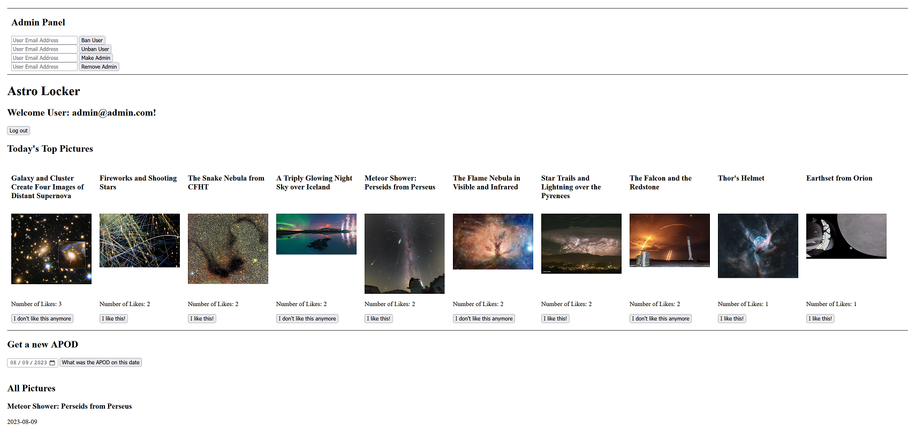

# Astro Locker

## Description

A simple web application written in Rust for bart Massey and Casey Bailey's CS-510 Rust Web Development Course at PSU in Summer 2023. AstroLocker is a social web app where Users can retrieve images from NASA's [Astronomy Picture of the Day](https://apod.nasa.gov/apod/astropix.html) and vote on them. It also includes basic admin user functionality to ban/unban users and promote/demote users from being admins. It uses the the [Axum](https://github.com/tokio-rs/axum) framework and [SQLx](https://github.com/launchbadge/sqlx) to query the postgres database.

## Setup

To fully test this out I recommend doing the following

* Make sure you have [Rust installed](https://www.rust-lang.org/tools/install)!
* Install [Docker](https://www.docker.com/products/docker-desktop/)
* Create a `./backend/.env` file based off of the one in `./backend/example.env`
* Navigate to `./backend` and run `docker compose up`
* Install the sqlx cli with `cargo install sqlx-cli --no-default-features --features rustls,postgres`
* Set up the database by running `sqlx database create` and `sqlx migrate run` from the `./backend` folder
* Launch the backend (`cargo run`) and navigate to `localhost:3000` in your browser
* Register a new user and write down their credentials
* Logout and register another user
* Using a tool like [Beekeeper Studio](https://github.com/beekeeper-studio/beekeeper-studio) (Use the free version) - add one of your users to the Admins table with the query `INSERT INTO admins (admin_user_id) VALUES (ID_OF_USER);` Where ID_OF_USER is the associated ID with the user you want to make an admin
* Log in as one of the users and create at least 11 posts with the `Get a new APOD` form. This will ensure there is enough data to display the top 10 posts (of course you could do less). Posts will need to have at least 1 vote to be considered for the top 10.
* Enjoy logging in as either user and seeing how the interface changes! Admins have all the functionality of a user with the added bonus of accessing the admin panel which lets them:
  1. Ban / Unban users from the server by email
  2. Promote / Demote users to admin by email
* Try banning a user and then logging in as them for a neat surprise :)

## What Worked

I think overall the application does what I set out to have it do. It allows users to vote on their favorite images and that information is dynamically updated in the database. Once I got the hang of it, the application routing and sqlx querying became fairly easy to use. I was also pleasantly surprised how easy it was to work with the data being returned by the [APOD api](https://api.nasa.gov/), I found it easy to map the values to my structs in the database.

## What Didn't Work / What I Didn't Have Time For

However there were quite a few hiccups. Mainly due to my relative inexperience with the language. I've outlined a few things that stood out to me that I was unable to implement in a timely manner.

* Most database errors don't gracefully redirect. This includes things like trying to login as a user who doesn't exist or selecting a date for the NASA api that is out of the allowed range.
* I spent a lot of time fighting with strings and the concept of borrowed values. Often took the easy way out with .clone() but I'm sure that's improper.
* I've also made some functionality that require DB calls when it probably wasn't necessary. I'm thinking specifically with admins having to make 2 db calls to promote / demote admins. I'm thinking this is more a SQL design problem (I wanted to try joining tables and push the work off to the database engine)
* When going to the frontend, a lot of my database functions needed to be drastically changed to accomodate forms instead of straight queries. Again, this is mainly due to my inexperience with the engine and misunderstanding how some of the routing worked.
* Like most software projects, tests unfortunately ended up on the cutting room floor. I do enjoy how Rust makes them straightforward to make though.
* I never got validation that user emails were in the correct `xxx@xxx.xxx` form. I felt that I was having enough trouble with strings that I would cut my losses and assume people use the correct form. Functionally, they are usernames right now.
* I did not account for videos being sent back, some results (like 2020-12-9) are youtube links. I would need to conditionally render these or reject them.

## What Was Learned

There is a great deal that I learned about how rust handles values and moves data around. I am still warming up to it but it seems to make sense and protects the user from making mistakes. Though I do have quite a vendetta against Rust string handling. That's something I will look up in the future. Overall, I think this was a good primer to the language and while my project might be a little thrown together, I can see myself working in it in the future and taking the lessons learned with me to the next project.
